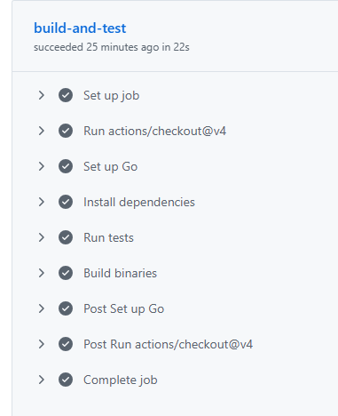

# cli go-calculator
* A simple calculator written in Go that supports addition, subtraction, multiplication, and division.
* Project is focused on TDD, app design, basic go CLI functionality, and CICD
* See branches for code evolution and design changes.

[](https://github.com/rstoltzm-profile/go-calculator/actions/workflows/ci.yml)

## Inputs
| Name | Type | Description |
| ---- | ---- | ----------- |
| `--num1` | `int` | First number for the operation |
| `--num2` | `int` | Second number for the operation |
| `--oper` | `string` | Operation to perform: `add`, `sub`, `mult`, or `div` |

## CICD
### Inputs

### Workflow Run

### Autotest on Merge


## Makefile
### Build
To build the application, run:
```base
make build
```

### Test
To build the application, run:
```base
make test
```

## Example

```bash
bin/go-calculator-linux --num1 1 --num2 2 --oper add
```
```text
GO Calculator App
Oper:    add
Inputs:  1 2
Output: 3
```
